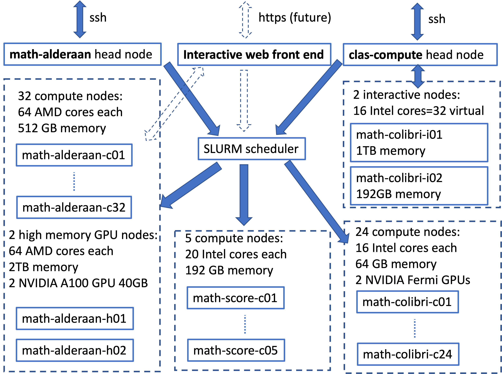

# Clusters Overview

## Quick basics 

* Connect by command line ssh to one of the head nodes,  
`ssh math-alderaan.ucdenver.pvt` or `ssh clas-compute.ucdenver.pvt`   
using your university username and password. 

* Write a job script, say `myjob`, with the commands to execute and special
 comments how many cores and which kind of node it needs (=partition name). See
  [examples](../examples) for details.

* Submit the script to the SLURM scheduler by `sbatch myjob` 
 
* The scheduler finds a compute node with enough free cores, marks the cores as allocated, and starts executing the job script on the node.

## More advanced use

* If you need special software that is not installed on the compute nodes, have the job execute your code in a [singularity container](../singularity), which can carry the complete software environment with it.

* Request estimated number of cores your code needs if you do not know exactly how many (e.g., some codes in R)

* If you want your job to run for a long time (weeks and more): use the math-score partition 

* If you run sofware that needs [modules](../modules) loaded first: load the modules in your job script. **On alderaan only**

* If you have MPI code to use multiple cores and nodes as a single large computer, ask
 for enough cores and run your executable as argument to `mpirun` command. Make
 sure you use the same MPI version (GNU or Intel) to build and run the code. 
 See `/home/jmandel/templates` for examples. **On alderaan only**

* If you need to run interactively, not a script, ssh from `clas-compute.ucdenver.pvt`
to one of the interactive nodes, `math-colibri-i01` or `math-colibri-i02`. Or, run
interactively on a more powerful alderaan node by entering the magic line   
    `srun --pty -N 1 -n 1 -t 1:00:00 -p math-alderaan /bin/bash -l`  
on math-alderaan. This command will start an interactive shell job on one alderaan
core for one hour max and transfer you to that shell session.
    
* If you need to run in [Python](../python) with custom environments.

* Sorry the graphical web access for Jupyterhub, Rstudio, remote desktop, etc., does not work yet.

